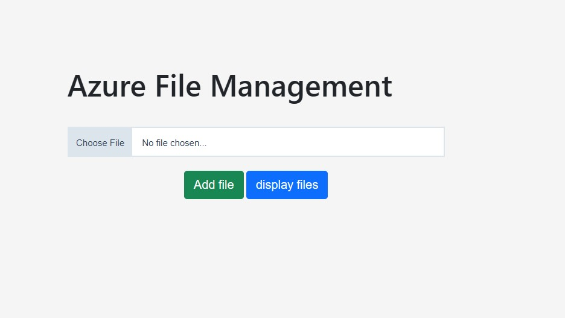
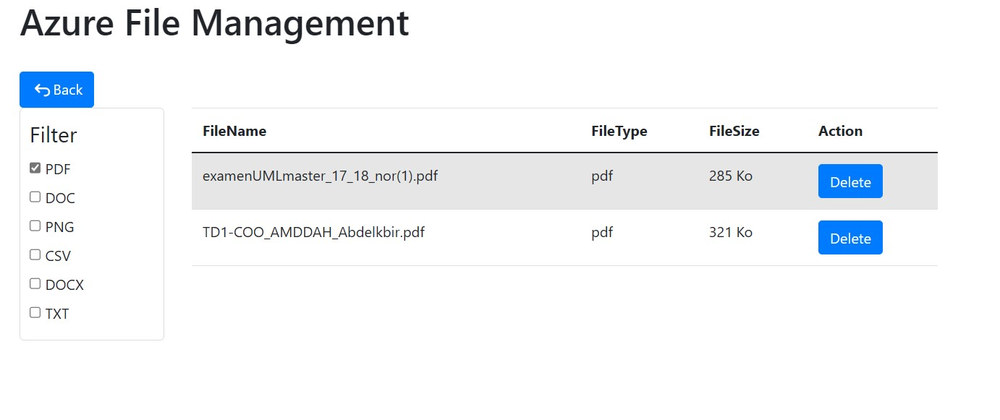

# File Management Flask App

## Overview

This is a simple Flask web application for file management. It provides basic functionalities for uploading and downloading. The application is designed to be deployed on the Azure cloud platform.

## Technologies Used

- Python
- Flask
- Azure Blob Storage (for file storage)

## Getting Started

1. Clone the repository:

   ```bash
   git clone https://github.com/amddah/File_Management_Flask.git
   ```
2. Create a virtual environment:

```shell
python -m venv venv
```

3. Activate the virtual environment:

```shell
# On Windows
venv\Scripts\activate

# On macOS/Linux
source venv/bin/activate
```
4. Install dependencies:
   ```bash
    pip install -r requirements.txt
  
5. Run the application:
    ```bash
    flask run
## Screenshot




## License

This project is licensed under the MIT License. See the [LICENSE](LICENSE) file for more information.

